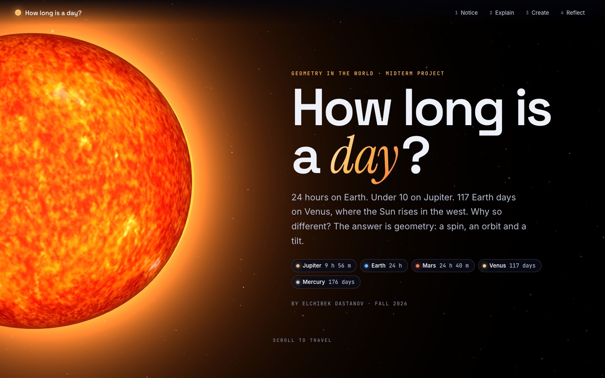
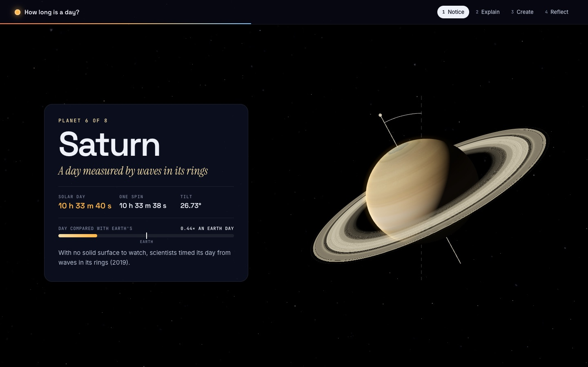
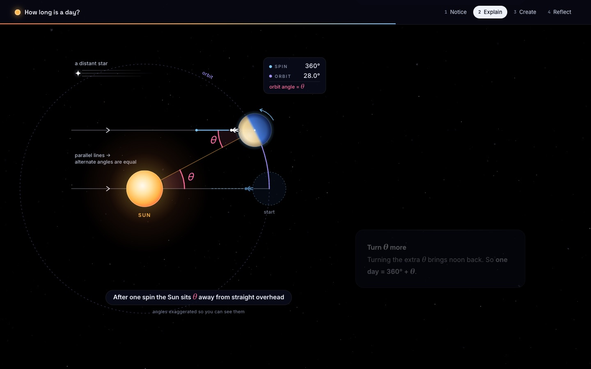
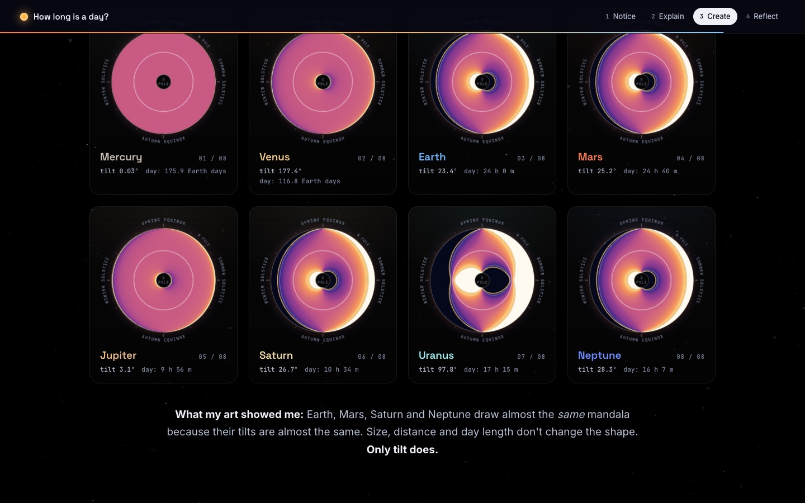
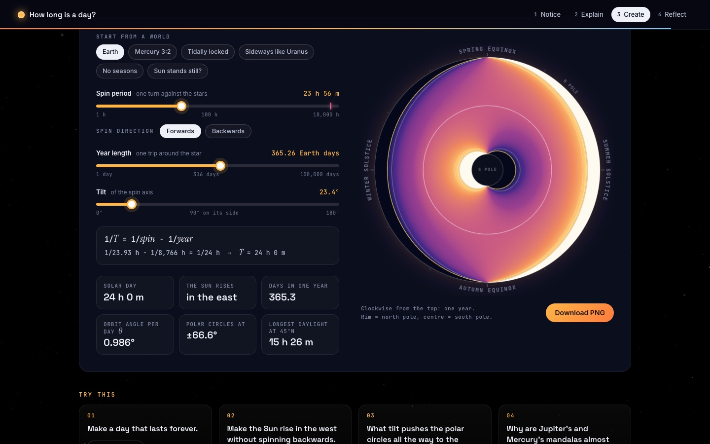

# How Long Is a Day?

**An interactive 3D tour of the solar system that explains why every planet has a different day length, using simple geometry.**

### [▶ Open the live site](https://elchibek5.github.io/how-long-is-a-day/)



A day lasts 24 hours on Earth, under 10 hours on Jupiter, and 117 Earth days on Venus, where the Sun rises in the west.
This site shows why with three ideas from geometry: a **spin**, an **orbit** and a **tilt**. No install, no sign-up: just scroll.

## What's inside

| | |
|---|---|
|  | **3D planet tour.** Fly past all eight planets as you scroll. Each one has its real axial tilt and spins at its true relative speed, lit from one side so you can see day and night. |
|  | **The missing angle.** A scroll-driven diagram shows why one spin is not one day: the planet must turn an extra angle θ, and alternate angles prove it. |
|  | **Sunlight Mandalas.** Generative art that shows a planet's whole year of daylight in one circle. Tilted planets draw a yin-yang of light. |
|  | **Design your own world.** Pick a spin, a year and a tilt. Get the day length, see the mandala, download it as a poster. |

## The math in one minute

1. In one solar day *T*, a planet moves around the Sun by an angle **θ = 360° · T / T<sub>year</sub>**.
2. To face the Sun again it must spin **360° + θ** (or 360° − θ if it spins backwards, like Venus).
3. Put together:

   **1 / T = 1 / T<sub>spin</sub> − 1 / T<sub>year</sub>** (use + for a backwards spin)

- **Earth:** θ ≈ 0.986° per day, which takes 3 min 56 s to turn. 23 h 56 m 4 s + 3 m 56 s = 24 h.
- **Mercury:** it spins 3 times every 2 orbits, so the formula gives a day of exactly **two Mercury years**.
- **Daylight:** sunlight lights half of a planet. The lit fraction of your circle of latitude is the fraction of the day the Sun is up: cos H₀ = −tan φ · tan δ.

Every number on the site is computed from these formulas, and `npm test` checks them against NASA's published day lengths.

## Use it in your classroom

- Open the [live site](https://elchibek5.github.io/how-long-is-a-day/) on a projector or a phone and scroll.
- It fits lessons on **angles and parallel lines**, **rates and reciprocals**, **proportions**, **trigonometry** and **seasons**.
- Change any planet's numbers or text in [`src/data/planets.js`](src/data/planets.js); the whole site updates.

## Run it locally

```bash
npm install
npm run dev      # http://localhost:5173
npm test         # checks the math against NASA's numbers
npm run build    # static site in dist/
```

## Put your own copy online

1. Fork this repository.
2. In your fork, go to **Settings → Pages** and set **Source** to **GitHub Actions**.
3. Push to `main`. The site deploys automatically.

The build in `dist/` is plain static files with relative paths, so it also works on Netlify, Vercel or any web host.

## How the code is organized

| Folder | What it does |
|---|---|
| `src/data/planets.js` | Every planet number in one place: spin, year, tilt, colors, facts |
| `src/lib/astro.js` | The math: solar day, declination, daylight |
| `src/scene/` | The three.js scene: the Sun, the planets and the scroll animation |
| `src/viz/` | The missing-angle diagram, the NASA check and the daylight lab |
| `src/create/` | Sunlight Mandalas and the design-your-own-world lab |
| `tests/` | Tests that compare the math with NASA's values |

## Contributing

Ideas and pull requests are welcome: translations, dwarf planets, moons, or new classroom activities.

## Credits

- Data: [NASA Planetary Fact Sheets](https://nssdc.gsfc.nasa.gov/planetary/factsheet/); Saturn's day from [NASA, 2019](https://science.nasa.gov/solar-system/scientists-finally-know-what-time-it-is-on-saturn/); Uranus's day from [ESA/Hubble, 2025](https://esahubble.org/news/heic2503/).
- Mars sunset photo: NASA/JPL-Caltech/MSSS/Texas A&M Univ. ([PIA19400](https://photojournal.jpl.nasa.gov/catalog/PIA19400)).
- Planet textures: [Solar System Scope](https://www.solarsystemscope.com/textures/) (CC BY 4.0); Earth maps from the [three.js examples](https://github.com/mrdoob/three.js) (NASA Blue Marble).
- Built with [three.js](https://threejs.org/), [Vite](https://vitejs.dev/), [KaTeX](https://katex.org/) and [Lenis](https://lenis.darkroom.engineering/).

## License

[MIT](LICENSE) © 2026 Elchibek Dastanov. Third-party images keep their own licenses, listed above.
